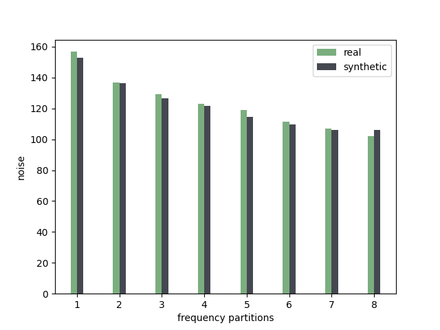

# GaLoRe Experimental

The experimental repository for the GaLoRe project

## Current Configuration

Currently, the project is configured to run tests over the CIFAKE data set in
the frequency domain. Running the code will generate a graph which shows the
difference in average noise levels in the partitions of the frequency domains
of real and fake images.

## Setup

To setup the project use

`make setup`

## Run

To run the source code use

`make run`